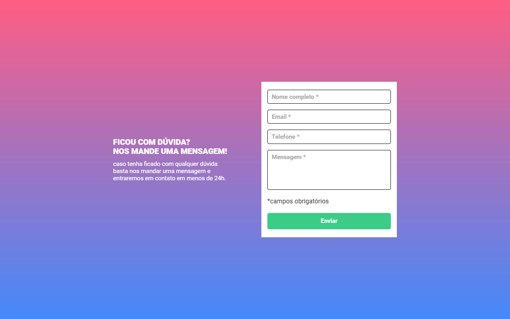
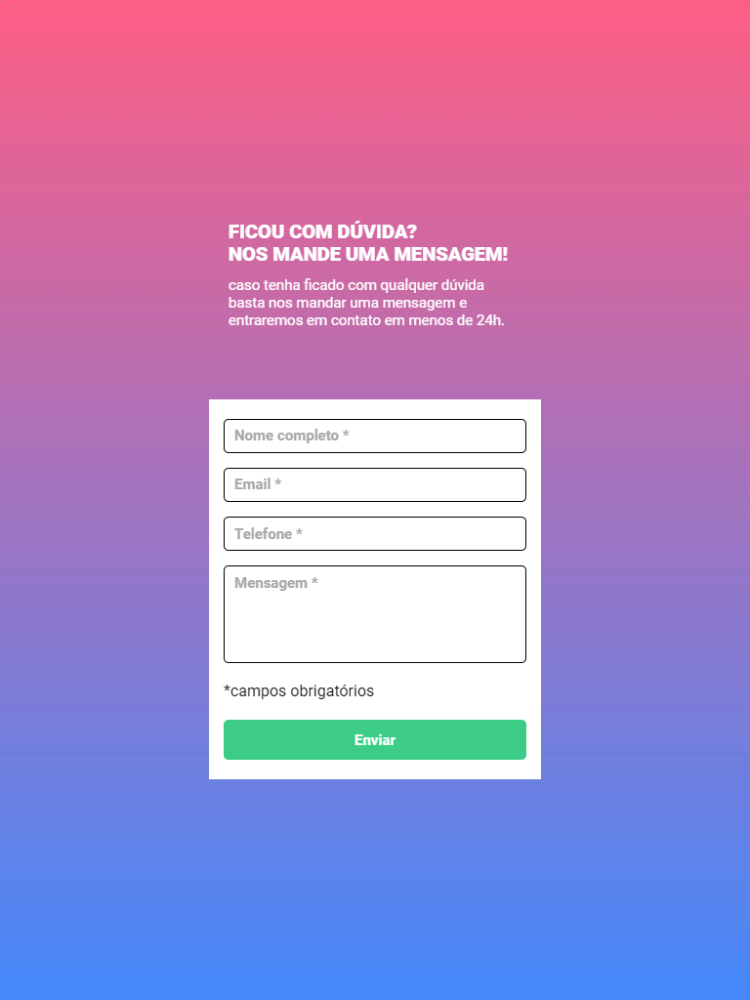
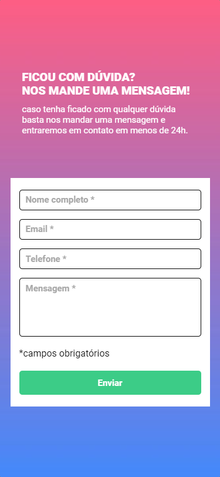

# Formulario com Validação

Este é um desafio proposto no curso do [Dev em Dobro(DevQuest)](https://www.instagram.com/devemdobro)

## Índice

- [Visão geral](#visão-geral)
   - [O desafio](#o-desafio)
   - [Captura de tela](#captura-de-tela)
- [Meu processo](#meu-processo)
   - [Construído com](#construído-com)
   - [O que aprendi](#o-que-aprendi)
- [Autor](#autor)

## Visão geral

### O desafio
O desafio que foi passado pelo curso era necessario criar um formulario com validação full JavaScript, onde se em algum dos campos não estiver preenchido corretamente não sera possivel fazer o envio do formulario

Os usuários devem ser capazes de:

- Ver o layout ideal para a página, dependo do tamanho da tela de seu dispositivo
- Ver as interações dos campos dos inputs dependo de como for preenchido

### Captura de tela





## Meu processo

### Construído com

- Marcação HTML5 semântica
- Propriedades personalizadas CSS
- Flexbox
- Grid
- Metodos e funções em JavaScript para a interação
- Manipulação do DOM
- Regexp(Expressões regulares)

### O que eu aprendi

Consegui melhorar minha logica em programação e minhas tecnicas em clean code, aprendi bastante sobre os conceitos de expressões regulares(Regexp) e funções

```js
function telefoneValido(telefone) {
        let telefoneValid = /^[(1-9)]{2}\s?9?\s?[2-9]\d{3}[- ]?\d{4}$/

        if (telefoneValid.test(telefone)) {
            return true
        }

        return false
    }
    
    function emailValido(email) {
        let emailValid =  /^[a-zA-Z0-9._-]+@[a-zA-Z0-9._-]+\.[a-zA-Z]{2,}$/

        if (emailValid.test(email)) {
            return true
        }

        return false
    }
```
## NOTA:

- O tamanho de tela 320px ficou um pouco esquisito, ela ficou bastante apertada, mas consegui dar uma respirada nas laterais para não ficar tão feio.

## Autor

- Linkedin - [Luis Fernando Macedo](https://www.linkedin.com/in/luis-fernando-macedo-7791ba219)
- Instagram - [Luis Fernando](https://www.instagram.com/luis._.fernand0_)